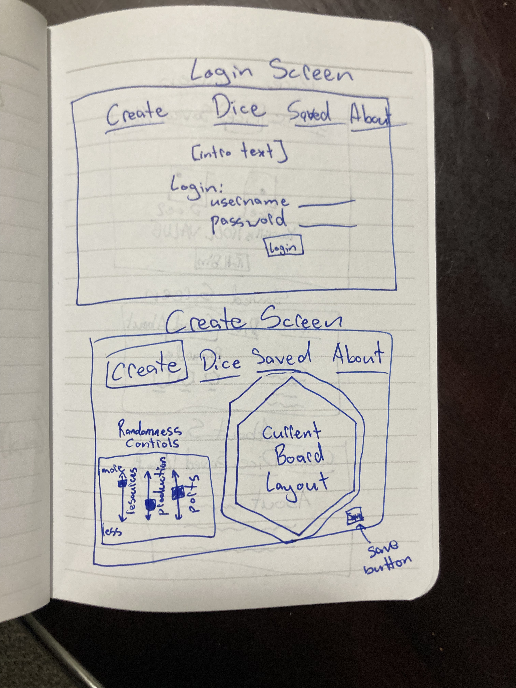
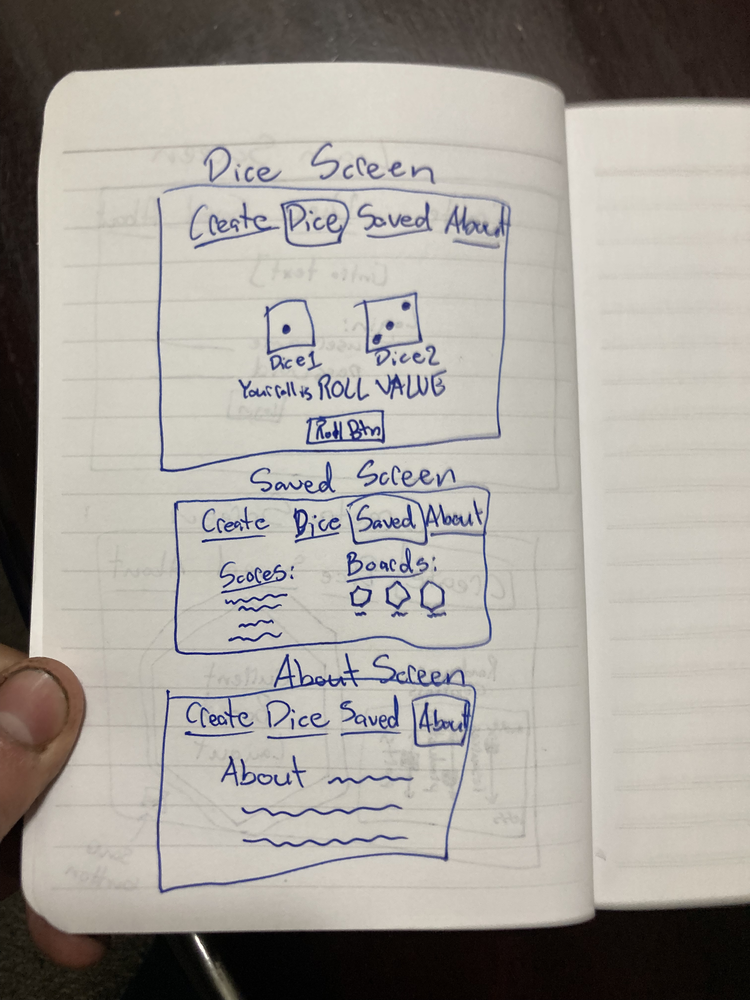

# catan
This is a repo to keep track of all the code for a Settlers of Catan API

## Description
### Elevator Pitch
Everyone loves the intricate and exciting game of Catan! One of the most beloved features of the game is the scale of invitie possibilies that the game offers. There are nearly a limitless number of combinations of resource arrangements and number placements on the board, not to mention the placement of settlements and rolling of the dice. What a random, chaotic mess that results in so much fun!
This web app is designed to maximize the fun you can have with the randomness of Catan while minimizing the headache of worrying about resource balance and trying to place the board in the ideal positions. The different pages of this web app allow the user to create boards, save information to a profile and roll dice to create a simpler and exciting Catan experience for anyone!

### Design
The "Login" and "Create" screens.

The "Dice", "Saved" and "About" screens.

### Key Features
1. HTTPS for secure login
2. Profile information (including username and password) and persistently stored.
3. Ability to create a new board, with random elements for each of the different aspects of a board.
4. Ability to use Dice to roll more reliably during the game.
5. Boards and scores can be persistantly stored if one is logged in.
6. Ability to share boards you have created in an image format.
7. Ability to turn on and off extra random features in the dice mode (1% chance of desert producing, etc)
8. Display of motivational quote on About page.

## Technologies
I will use the required technologies in these ways.

* __HTML__ - Uses correct HTML structure for application. At least 4 HTML pages for login, board creation, dice and scores/boards from past games. Hyperlinks to these pages. 
* __CSS__ - Application styling so that it looks good on different screen sizes, uses whitespace and color well, and has consistency of format between pages.
* __JavaScript__ - Provides login, choice display, saving info, creating boards (this will be pretty complex), rolling dice, getting motivational quote, and more.
* __Service__ - Backend service with endpoints for:
  * login
  * retrieving boards
  * submitting boards
  * retriving scores
  * submitting scores
* __DB__ - Store user profiles, boards, and scores in database.
* __Login__ - Register and login users. Credentials securely stored in database. Can't save or retrieve items unless authenticated.
* __WebSocket__ - A motivational quote will be hooked up to the about page. 
* __React__ - Application ported to use the React web framework.
